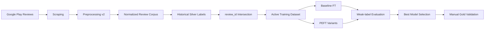

# Fintech Review ABSA


An end-to-end Aspect-Based Sentiment Analysis pipeline for Indonesian fintech lending app reviews from the Google Play Store. The project combines data collection, text normalization, weak-label curation, transformer fine-tuning, evaluation, and a Streamlit dashboard for interactive analysis.

## Why This Project

Most sentiment-analysis demos stop at binary polarity. This repository pushes further into aspect-level sentiment on noisy Indonesian user reviews, where one sentence can mix complaints about risk, trust, and service at the same time.

This makes the project useful as a portfolio artifact for:

- practical ABSA pipeline design
- Indonesian text normalization and slang handling
- weak-label to cleaner-dataset reconciliation
- IndoBERT fine-tuning and PEFT comparison
- research-oriented experimentation with an application layer on top

## Problem Scope

The project models three business-relevant aspects:

- `risk`
- `trust`
- `service`

Each aspect is classified into:

- `Negative`
- `Neutral`
- `Positive`

## Project Snapshot

| Area | Current Choice |
| --- | --- |
| Domain | Indonesian fintech app reviews |
| Apps | Kredivo, Akulaku |
| Task | 3-aspect ABSA |
| Backbone | `indobenchmark/indobert-base-p1` |
| Training tracks | Baseline full fine-tuning, LoRA, DoRA, AdaLoRA, QLoRA |
| Active public dataset | `data/processed/dataset_absa_50k_v2_intersection.csv` |
| Gold evaluation direction | Manual single-annotator gold subset |
| Dashboard | Streamlit observatory for live and offline analysis |

## Pipeline Overview



## What Is In This Public Repo

Included:

- source code for the data, training, evaluation, and dashboard pipeline
- curated processed assets that help explain the work
- evaluation summaries and comparison tables
- annotation template and supporting documentation
- selected visuals used for paper and portfolio presentation

Excluded:

- raw scraped data dumps
- trained model weights and checkpoints
- droplet snapshots and machine-local folders
- debug outputs, cache files, and temporary artifacts
- secrets and local environment files

## Repository Layout

```text
.
|-- app.py
|-- config.py
|-- requirements.txt
|-- src/
|   |-- data/
|   |-- training/
|   |-- evaluation/
|   |-- dashboard/
|   `-- inference.py
|-- scripts/
|-- docs/
|-- data/
|   |-- processed/
|   `-- resources/
`-- tests/
```

Key files:

- `app.py`: Streamlit dashboard entry point
- `src/inference.py`: model loading and multi-aspect prediction
- `src/training/train_baseline.py`: baseline fine-tuning pipeline
- `src/training/peft_family_utils.py`: shared PEFT training utilities
- `src/evaluation/evaluate.py`: evaluation summary builder
- `scripts/build_v2_intersection.py`: active dataset builder
- `scripts/recommend_epoch_from_epoch_sweep.py`: epoch recommendation helper

## Reproducibility Notes

This repo is curated for public review, not for shipping full model weights. The current public setup is intended to be understandable and partially reproducible without bundling all private or large artifacts.

Important context:

- the active training dataset is `data/processed/dataset_absa_50k_v2_intersection.csv`
- the labeling pipeline targets the v2 corpus and writes to `dataset_absa_v2.csv`
- gold evaluation artifacts in Git are kept at summary level; detailed per-model prediction dumps are intentionally excluded
- dashboard research loaders prefer repo-local assets and can optionally be pointed to external artifacts through environment variables such as `SKRIPSI_MODEL_ROOT` and `SKRIPSI_GOLD_EVAL_DIR`

## Quick Start

### 1. Environment Setup

```powershell
python -m venv .venv
.\.venv\Scripts\Activate.ps1
pip install -r requirements.txt
```

Optional:

- copy `.env.example` to `.env` if you want to run LLM-assisted silver labeling

### 2. Run the Dashboard

```powershell
python -m streamlit run app.py
```

### 3. Run Evaluation Summary

```powershell
python -m src.evaluation.evaluate
```

### 4. Run Tests

```powershell
pytest -q
```

## Training Entry Points

PowerShell runners:

```powershell
.\scripts\run_baseline_epochs.ps1
.\scripts\run_lora_epochs.ps1
.\scripts\run_peft_hparam_sweep.ps1
.\scripts\run_training_experiments.ps1
```

If you are reading this repo as a research artifact, the main experiment reference is:

- `docs/MODEL_EPOCH_AND_EXPERIMENT_PROTOCOL_2026-03-31.md`

Supporting documentation:

- `docs/MODELLING_PIPELINE_CONCISE.md`
- `docs/MODEL_BUILDING_PIPELINE_SIMPLE.md`
- `docs/LABEL_SCHEMA_FINTECH_ABSA.md`
- `docs/UNCERTAINTY_DIAMOND_STANDARD_RULES.md`
- `docs/ISSUE_TAXONOMY_DIAMOND_STANDARD_2026-03-31.md`

## Portfolio Highlights

This repository demonstrates:

- end-to-end NLP workflow design
- applied Indonesian-language ABSA
- experiment tracking and comparison discipline
- parameter-efficient fine-tuning with transformer models
- translation of research outputs into an interactive product layer

## Selected Assets

Portfolio-friendly visuals are kept in:

- `docs/paper_assets/used/`

## Current Limitations

- model checkpoints are not bundled in this public repository
- the gold subset is single-annotator, not a full multi-annotator diamond setup
- some GPU-specific scripts assume a separate training environment

## License

This project is released under the MIT License. See `LICENSE`.
