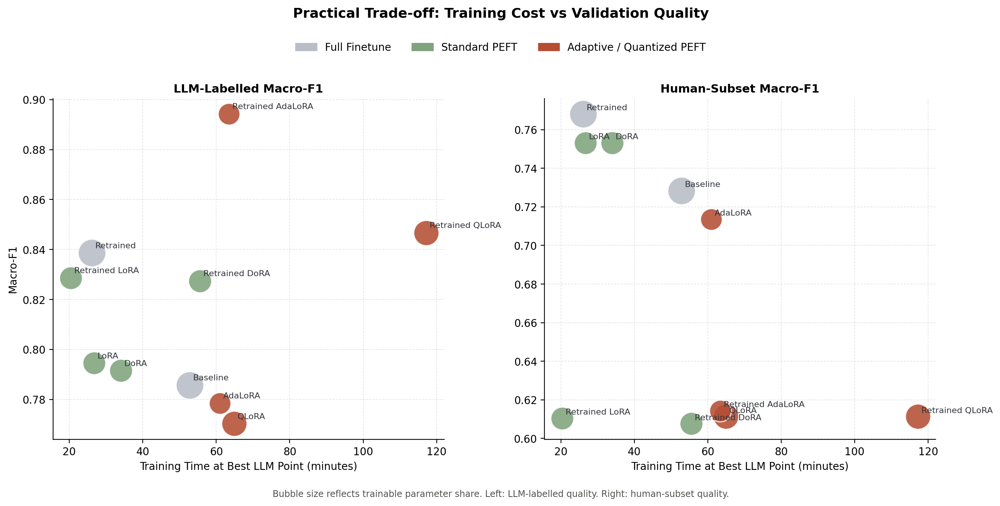
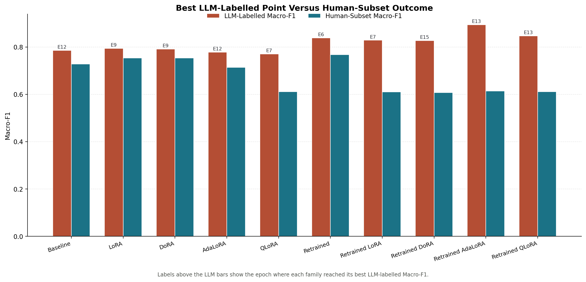
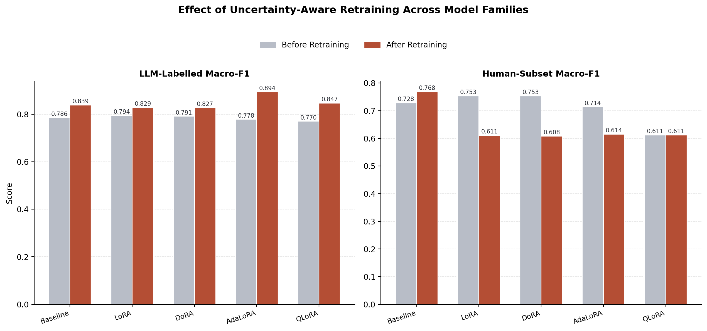
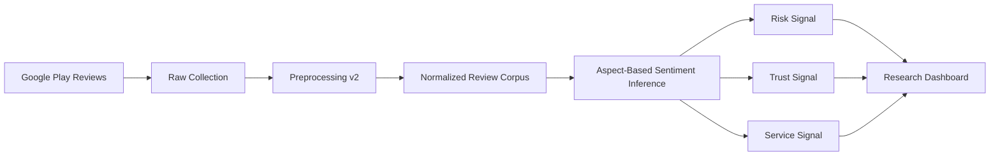
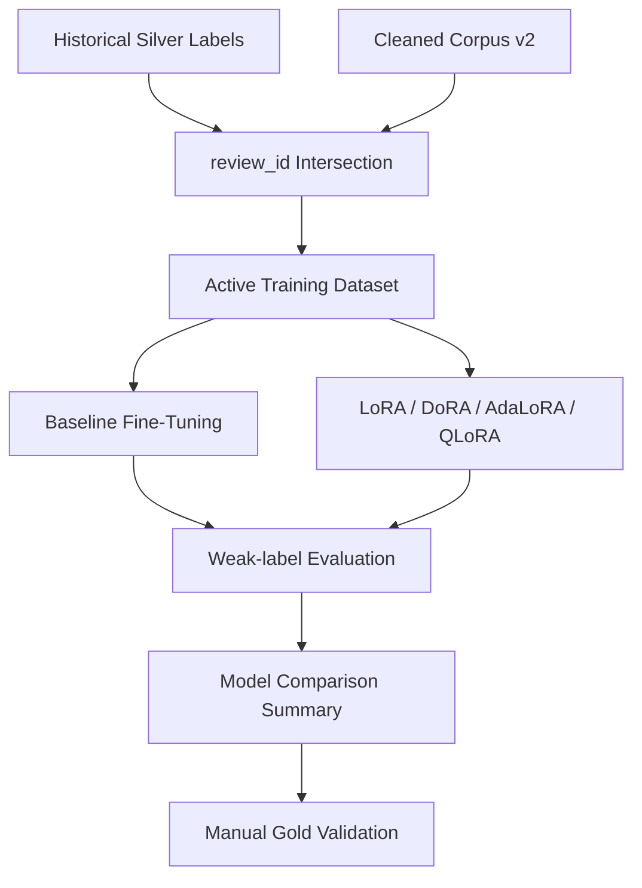
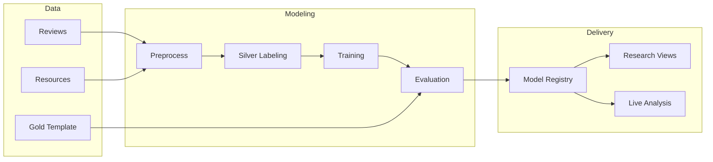
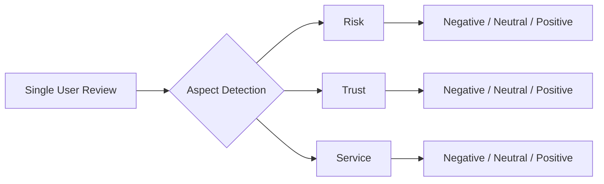

<div align="center">

# Fintech Review ABSA - Enterprise Review Intelligence Platform

<p align="center">
  
  
  
  
  
  
</p>

<p align="center">
  
  
</p>

<p align="center">
  <em>
    An end-to-end machine learning application for transforming noisy Indonesian fintech app reviews
    into structured business signals across risk, trust, and service dimensions.
  </em>
</p>

</div>

---

## Business Impact

Designed for a fintech review-mining context, this platform converts raw public feedback into actionable sentiment intelligence. Instead of reducing app reviews to generic positive-vs-negative polarity, the system isolates feedback by business-relevant aspect so product, operations, and trust teams can see where user pain is actually concentrated.

This matters because fintech reviews often combine multiple signals in one sentence: debt collection pressure, fee concerns, app instability, customer support failures, or platform legitimacy. The value of this project is in separating those signals into structured outputs that are easier to analyze, compare, and operationalize.

---

## Platform Preview

<p align="center">
  
  
</p>

<p align="center">
  
</p>

---

## Core Flows

### 1. Review-to-Insight Flow



This is the main product-facing flow: raw reviews are normalized, scored by aspect, and surfaced as structured signals through the dashboard layer.

### 2. Training and Evaluation Flow



This flow shows how the repo handles experimental rigor: historical labels are not thrown away, but reconciled with the newer preprocessing pipeline before training and comparison.

### 3. Delivery Architecture Flow



This flow represents the system as a layered platform rather than a one-off notebook pipeline.

### 4. Business Signal Decomposition



This is the core modeling decision of the project: one review can contain multiple business signals, so aspect separation is treated as a first-class requirement.

---

## Key Features

### Multi-Aspect Sentiment Classification

The model predicts sentiment separately for:

- `risk`
- `trust`
- `service`

This gives much stronger diagnostic value than a single overall sentiment label.

### Weak-Label to Cleaner-Dataset Reconciliation

The active experiment track uses an intersection-based dataset strategy so historical silver labeling work remains useful while the newer preprocessing pipeline becomes the source of truth.

### Baseline and PEFT Experiment Tracks

The repository compares full fine-tuning with PEFT families such as LoRA, DoRA, AdaLoRA, and QLoRA to show both performance and engineering tradeoffs.

### Interactive Research and Delivery Dashboard

The Streamlit application is not just a demo page. It acts as a review intelligence interface for offline experiment artifacts and live review inference.

---

## Architecture & Tech Stack

Built as an applied ML research system with a delivery layer for inspection, analysis, and demo use.

- Application layer: Streamlit
- NLP / modeling: Transformers, PyTorch, PEFT
- Data processing: Pandas, NumPy, scikit-learn
- Storage / artifact support: DuckDB
- Data source: Google Play Scraper
- Visualization: Plotly, Matplotlib

---

## What I Worked On

- Designed and maintained the end-to-end ABSA workflow for Indonesian fintech reviews
- Built the preprocessing and dataset-reconciliation path used by the active experiment setup
- Developed baseline and PEFT training/evaluation utilities for model comparison
- Built the Streamlit dashboard for experiment inspection and live inference
- Curated the public version of the repository into a portfolio-grade engineering artifact

## How To Review This Repository

- Start with `app.py` for the main dashboard entry point
- Review `src/inference.py` for model loading and multi-aspect prediction
- Review `src/training/train_baseline.py` and `src/training/peft_family_utils.py` for experiment execution logic
- Review `src/evaluation/evaluate.py` for artifact summarization and model comparison outputs
- Review `src/dashboard/registry.py` and `src/dashboard/research.py` for how artifacts are surfaced to the application
- Review `src/data/preprocess.py` and `scripts/build_v2_intersection.py` for dataset preparation logic

## Public Version Scope

This repository is a curated public portfolio version of a larger thesis and experimentation workspace.

- Source code for the data, modeling, evaluation, and dashboard layers is included
- Selected processed assets are included to make the workflow understandable
- Summary-level evaluation artifacts are included for inspection
- Large raw datasets, trained weights, checkpoints, and machine-local snapshots are excluded
- Debug screenshots, temporary artifacts, and cache noise are intentionally removed from the public version

## Reproducibility Notes

- Active public training dataset: `data/processed/dataset_absa_50k_v2_intersection.csv`
- Labeling pipeline target: `data/processed/reviews_clean_v2.csv` -> `data/processed/dataset_absa_v2.csv`
- Evaluation entry point: `python -m src.evaluation.evaluate`
- Test entry point: `pytest -q`
- Optional external artifact roots can be provided through environment variables such as `SKRIPSI_MODEL_ROOT` and `SKRIPSI_GOLD_EVAL_DIR`

## Quick Start

```powershell
python -m venv .venv
.\.venv\Scripts\Activate.ps1
pip install -r requirements.txt
python -m streamlit run app.py
```

Optional:

- copy `.env.example` to `.env` if you want to run LLM-assisted silver labeling

## Training Entry Points

```powershell
.\scripts\run_baseline_epochs.ps1
.\scripts\run_lora_epochs.ps1
.\scripts\run_peft_hparam_sweep.ps1
.\scripts\run_training_experiments.ps1
```

Primary supporting docs:

- `docs/MODEL_EPOCH_AND_EXPERIMENT_PROTOCOL_2026-03-31.md`
- `docs/MODELLING_PIPELINE_CONCISE.md`
- `docs/MODEL_BUILDING_PIPELINE_SIMPLE.md`
- `docs/LABEL_SCHEMA_FINTECH_ABSA.md`
- `docs/UNCERTAINTY_DIAMOND_STANDARD_RULES.md`
- `docs/ISSUE_TAXONOMY_DIAMOND_STANDARD_2026-03-31.md`

## Key Engineering Decisions

- Aspect-first problem framing instead of generic sentiment classification
- Intersection-based dataset construction to preserve historical label value while improving preprocessing consistency
- Baseline FT and PEFT tracks kept side by side for practical engineering comparison
- Dashboard positioned as a delivery layer, not just a thin demo shell
- Public GitHub curation prioritized over dumping the entire experimentation workspace

## Current Limitations

- Model checkpoints are not bundled in this public repository
- The gold subset is still single-annotator, not a full multi-annotator diamond setup
- Some training scripts assume a separate GPU-oriented environment
- The public version prioritizes portfolio clarity over one-command reproduction of every historical run

## License

This project is released under the MIT License. See `LICENSE`.
