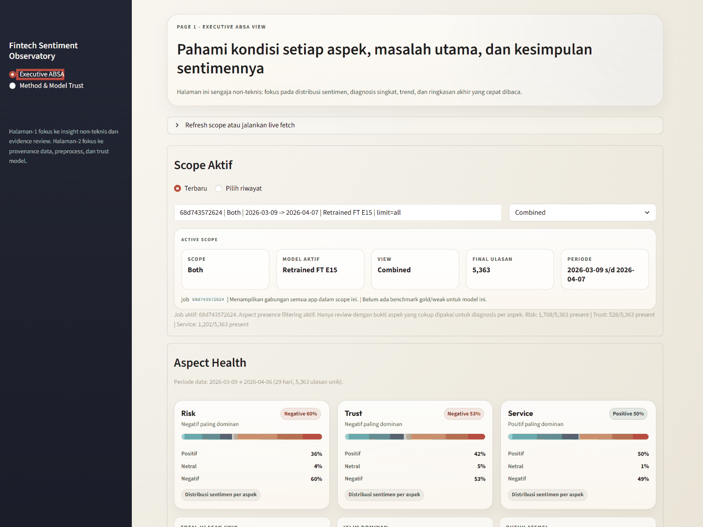
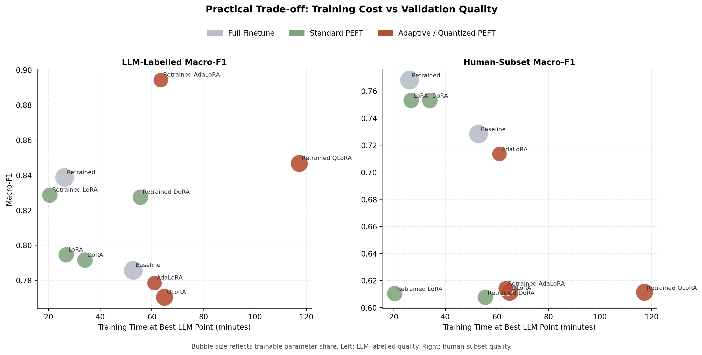
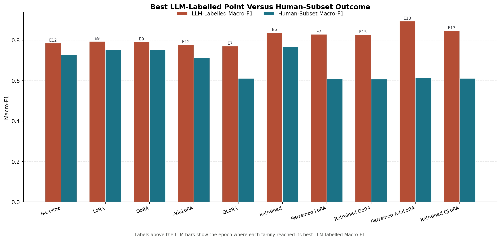
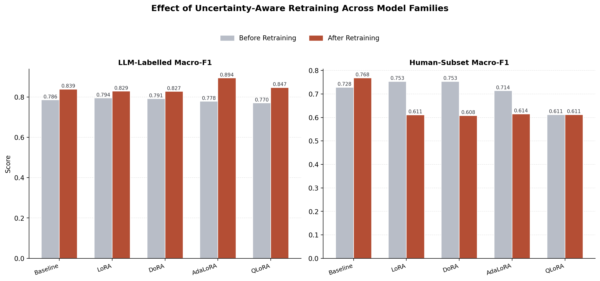
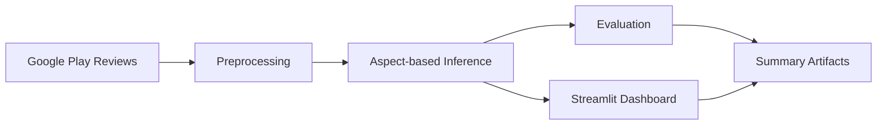

<div align="center">

# Fintech Review ABSA

<p align="center">
  
  
  
  
  
  
</p>

<p align="center">
  
  
</p>

<p align="center">
  <em>
    End-to-end applied ML workflow for turning Indonesian fintech reviews into structured signals on risk, trust, and service.
  </em>
</p>

<p align="center">
  <a href="https://huggingface.co/spaces/alvin-agustio/fintech-absa">
    
  </a>
</p>

</div>

---

## Quick Preview

<p align="center">
  
</p>

This is the actual Streamlit dashboard from the repository. The view is designed to make three things readable quickly: current coverage, aspect-level health, and the short diagnosis or trend sections that follow below.

---

## Overview

This repository turns public fintech app reviews into structured signals at the aspect level.

Instead of collapsing every review into one overall sentiment score, the pipeline separates the review into three domain-specific views:

- `risk`
- `trust`
- `service`

That makes the output more useful for product, operations, compliance, and analytics work. A single review can talk about pricing, app reliability, and privacy at the same time, so a one-label sentiment model is often too coarse.

---

## Concrete Example

The example below comes from the public training set in `data/processed/dataset_absa_50k_v2_intersection.csv` and uses the same `risk / trust / service` schema used throughout the repo.

| Input review | Model output | Business interpretation |
|---|---|---|
| `cicilan sudah lunas tapi bi ceking masi ada data nya kalau belom lunas. tidak bisa di percaya ini platformnya.` | `risk = Negative`<br>`trust = Negative`<br>`service = Negative` | This is more useful than a single negative label. The review points to billing or repayment record friction, a clear trust breakdown, and a poor service experience. That gives a business team a more actionable signal than generic polarity. |

This is the main value of the repo: it converts one noisy review into multiple actionable signals.

---

## What Is Included

- Aspect-based sentiment inference for `risk`, `trust`, and `service`
- Baseline and PEFT experiment tracks, including LoRA, DoRA, AdaLoRA, and QLoRA
- Preprocessing and dataset reconciliation for the active experiment setup
- Evaluation and summary artifacts for comparing runs
- A Streamlit dashboard for inspection, analysis, and live review inference

---

## Selected Artifacts

<p align="center">
  
  
</p>

<p align="center">
  
</p>

These charts summarize the tradeoffs across model variants and retraining choices.

---

## Pipeline


```mermaid
flowchart LR
    A[Google Play Reviews] --> B[Preprocessing]
    B --> C[Aspect-based Inference]
    C --> D[Evaluation]
    C --> E[Streamlit Dashboard]
    D --> F[Summary Artifacts]
    E --> F
```

The repo is organized around a practical loop: clean the reviews, predict aspect sentiment, compare the results, and surface them in a dashboard.

---

## Tech Stack

- Application layer: Streamlit
- NLP and modeling: Transformers, PyTorch, PEFT
- Data processing: Pandas, NumPy, scikit-learn
- Storage and artifact handling: DuckDB
- Data source: Google Play Scraper
- Visualization: Plotly, Matplotlib

---

## Repository Guide

If you want to inspect the code path quickly, start here:

- `app.py` for the main dashboard entry point
- `src/inference.py` for model loading and multi-aspect prediction
- `src/data/preprocess.py` and `scripts/build_v2_intersection.py` for dataset preparation
- `src/training/train_baseline.py` and `src/training/peft_family_utils.py` for training logic
- `src/evaluation/evaluate.py` for comparison and summary outputs
- `src/dashboard/registry.py` and `src/dashboard/research.py` for how artifacts are surfaced in the app

If you want to review this as a portfolio project, focus on three things:

- the dataset and preprocessing path
- the baseline vs PEFT experiment comparison
- the dashboard and live inference delivery layer

---

## Quick Start

```powershell
python -m venv .venv
.\.venv\Scripts\Activate.ps1
pip install -r requirements.txt
python -m streamlit run app.py
```

Optional:

- copy `.env.example` to `.env` if you want to run LLM-assisted silver labeling

---

## Reproducibility And Scope

- Active public training dataset: `data/processed/dataset_absa_50k_v2_intersection.csv`
- Labeling pipeline target: `data/processed/reviews_clean_v2.csv` -> `data/processed/dataset_absa_v2.csv`
- Evaluation entry point: `python -m src.evaluation.evaluate`
- Test entry point: `pytest -q`
- Optional external artifact roots can be provided through environment variables such as `SKRIPSI_MODEL_ROOT` and `SKRIPSI_GOLD_EVAL_DIR`

This is a curated public version of a larger thesis and experimentation workspace.

- Source code for the data, modeling, evaluation, and dashboard layers is included
- Selected processed assets are included to make the workflow understandable
- Summary-level evaluation artifacts are included for inspection
- Large raw datasets, trained weights, checkpoints, and machine-local snapshots are excluded
- Temporary artifacts and cache noise are intentionally removed from the public version

---

## Current Limitations

- Model checkpoints are not bundled in this repository
- The gold subset is still single-annotator, not a full multi-annotator diamond setup
- Some training scripts assume a separate GPU-oriented environment
- The public version prioritizes clarity over reproducing every historical run from one command
