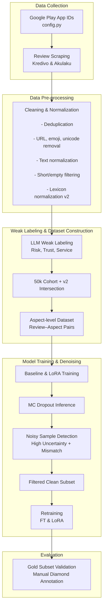

# Aspect Signal Hierarchy (Repo-Based)

Dokumen ini membuat tabel bergaya mirip contoh "emotion hierarchy", tetapi isinya disusun khusus dari aturan yang benar-benar ada di repo ini. Jadi ini bukan taxonomy baru, melainkan ringkasan operasional dari:

- `src/data/labeling.py`
- `data/processed/diamond/pedoman_anotasi_diamond.md`
- `docs/LABEL_SCHEMA_FINTECH_ABSA.md`

---

## Table 1

**Aspect signal hierarchy in the fintech lending domain based on weak-labeling rules and diamond annotation rules.**

| Aspect | Subordinate / indicative signals |
|---|---|
| **Risk** | (1) **biaya dan beban finansial**: bunga, denda, biaya admin, cicilan, tenor, potongan saldo; (2) **penagihan dan tekanan**: penagihan, debt collector, ancaman, keterlambatan bayar, tagihan masih berjalan; (3) **akses kredit dan pencairan**: limit kredit, skor kredit, pengajuan pinjaman ditolak, pencairan dana, dana tidak masuk; (4) **dampak kerugian langsung**: bayar tepat waktu tapi dibekukan, tagihan tetap muncul, risiko finansial, keamanan finansial |
| **Trust** | (1) **legalitas dan legitimasi**: legalitas, OJK, resmi; (2) **transparansi dan kejujuran**: transparansi biaya, tidak jelas, menyesatkan, kejujuran aplikasi; (3) **reputasi dan kredibilitas**: reputasi perusahaan, platform tidak bisa dipercaya, terpercaya; (4) **penipuan dan rasa aman**: scam, fraud, penipuan, rasa aman terhadap institusi; (5) **privasi dan data**: data disalahgunakan, hapus data saya, takut data bocor, platform tidak aman |
| **Service** | (1) **dukungan layanan**: customer service, CS, respons keluhan, CS tidak membantu; (2) **proses dan kecepatan**: kecepatan verifikasi, proses, respons, verifikasi lama; (3) **kinerja aplikasi**: bug, error teknis, crash, lemot, stabilitas aplikasi; (4) **akses dan penggunaan fitur**: login, reset PIN, fitur tidak berfungsi, paylater tidak bisa dipakai; (5) **pengalaman penggunaan**: UI/UX, kemudahan penggunaan, pengalaman memakai fitur |

---

## How to Read This Table

- Tabel ini tidak berarti setiap kata otomatis memetakan satu label secara mutlak.
- Fungsinya adalah memberi **gugus sinyal operasional** yang dipakai berulang dalam weak labeling dan validasi manual.
- Jika satu review memuat lebih dari satu gugus, maka penilaian tetap harus dilakukan **per aspek**, bukan berdasarkan tone umum review.

---

## Evidence Basis in the Repo

### 1. `src/data/labeling.py`

Weak-label prompt di file ini mendefinisikan:

- `Risk`: bunga, denda, penagihan, debt collector, ancaman, cicilan, tenor, limit kredit, skor kredit, pencairan dana, keamanan data pribadi, potongan saldo, risiko keterlambatan bayar
- `Trust`: legalitas OJK, transparansi biaya, kejujuran aplikasi, reputasi perusahaan, scam, fraud, penipuan, rasa aman terhadap institusi
- `Service`: customer service, respons keluhan, kecepatan verifikasi, login, UI/UX, bug, error teknis, kemudahan penggunaan, stabilitas aplikasi, pengalaman memakai fitur

File yang sama juga memberi contoh slang operasional:

- `scam -> Trust Negative`
- `dc galak -> Risk Negative`
- `lemot/error -> Service Negative`

### 2. `data/processed/diamond/pedoman_anotasi_diamond.md`

Pedoman diamond menegaskan fokus operasional berikut:

- `Risk`: biaya, bunga, denda, penagihan, ancaman, keamanan finansial, risiko penyalahgunaan
- `Trust`: kepercayaan, legalitas, transparansi, reputasi, privasi data, rasa aman terhadap platform
- `Service`: kualitas layanan, CS, kecepatan respon, stabilitas aplikasi, UX, bug, error, kemudahan penggunaan

### 3. `docs/LABEL_SCHEMA_FINTECH_ABSA.md`

Dokumen harmonisasi label schema memperjelas boundary antar-aspek, misalnya:

- isu `privacy/data misuse` lebih aman dipetakan ke `Trust`
- isu `fitur paylater error` lebih dekat ke `Service`
- isu `limit tidak bisa dipakai` bisa condong ke `Risk`

---

## Practical Note

Tabel ini aman dipakai untuk paper sebagai **operational aspect definition table**, selama penjelasannya tetap jujur:

- ini adalah ringkasan dari aturan anotasi yang dipakai di repo
- ini bukan teori psikometrik baru
- ini adalah aspect cue hierarchy yang bersifat domain-operational untuk fintech lending ABSA

---

## Figure 1

**Research flow adapted from the current repo pipeline.**

Diagram di bawah ini dibuat dengan fungsi yang mirip seperti gambar referensi: menunjukkan alur besar dari pengambilan data sampai anotasi dan modeling. Namun isi langkahnya disesuaikan dengan pipeline yang memang ada di repo ini.

### Notes

- `Google Play App IDs` berasal dari `config.py`, bukan dari lookup URL otomatis di runtime paper pipeline.
- `Weak Labeling with LLM` adalah langkah tambahan yang memang ada di repo ini, sehingga alur kita lebih panjang daripada contoh referensi.
- `Official 50k cohort and v2 intersection` ditampilkan terpisah karena dataset resmi training bukan langsung seluruh corpus hasil weak labeling.
- `Gold subset validation` adalah validasi manual di tahap akhir, bukan tahap awal pembuatan dataset skala besar.
