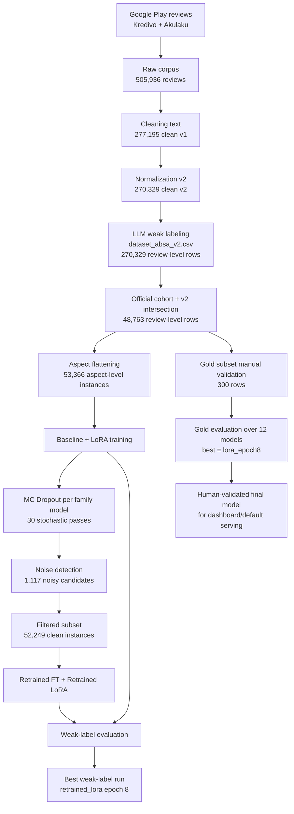

# Experimental Design, Materials and Methods

Dokumen ini merekonstruksi bagian "Experimental Design, Materials and Methods" dengan dasar artefak yang benar-benar ada di repo ini. Formatnya dibuat ringkas dan menyerupai gaya section 3 pada paper acuan, tetapi seluruh isi tetap dibatasi pada bukti yang bisa dilacak ke code, config, dataset, dan report di repo.

Jika ada detail yang tidak bisa dipastikan hanya dari repo, hal itu disebutkan secara eksplisit.

---

## 3.1 Overall Experimental Flow

Secara umum, pipeline penelitian ini terdiri dari tujuh tahap utama: pengumpulan review Google Play, preprocessing dan normalisasi teks, weak labeling berbasis LLM, pembentukan cohort training resmi, training model ABSA, uncertainty-aware filtering dan retraining, lalu validasi manual menggunakan gold subset.

---

## 3.2 Materials

Table 1 merangkum material utama yang dipakai dalam pipeline.

| Material | Evidence in repo | Role in pipeline |
|---|---|---|
| Raw review corpus | `data/raw/reviews_raw.csv` | Sumber data mentah hasil scrape Google Play |
| Clean corpus v2 | `data/processed/reviews_clean_v2.csv` | Teks yang sudah dibersihkan dan dinormalisasi |
| Weak-labeled review-level corpus | `data/processed/dataset_absa_v2.csv` | Review-level ABSA corpus dengan tiga aspek |
| Official training cohort | `data/processed/dataset_absa_50k_v2_intersection.csv` | Dataset resmi yang dipakai untuk eksperimen modeling |
| 50k cohort manifest | `data/processed/manifests/stratified_50k_seed42_v2_intersection.csv` | Manifest cohort dan jejak intersection ke corpus v2 |
| Gold subset | `data/processed/diamond/template_anotator_tunggal_balanced_300_aspect_rows.csv` | Validasi manual pada level `(review, aspect)` |
| Weak-label evaluation report | `droplet/skripsi_eval_core/data/processed/evaluation/evaluation_summary.json` | Ringkasan hasil baseline, LoRA, retraining, dan uncertainty-aware filtering |
| Gold evaluation overview | `data/processed/diamond/evaluation_all_models/gold_evaluation_overview.csv` | Perbandingan semua model pada gold subset |

---

## 3.3 Data Collection

Data dikumpulkan dari Google Play Store untuk dua aplikasi fintech lending Indonesia yang didefinisikan di `config.py`, yaitu:

- `Kredivo` (`com.finaccel.android`)
- `Akulaku` (`io.silvrr.installment`)

Scraping diarahkan ke konteks Indonesia dengan parameter berikut:

- `lang = "id"`
- `country = "id"`
- `DATE_START = "2024-01-01"`
- `DATE_END = "2026-01-31"`

Secara praktis, `lang="id"` dan `country="id"` berfungsi untuk memprioritaskan review berbahasa Indonesia dan storefront Indonesia, tetapi parameter ini bukan validator bahasa yang sempurna.

Kolom utama pada raw corpus adalah:

- `app_name`
- `rating`
- `review_text_raw`
- `review_date`

Jumlah raw review yang tersedia di repo adalah **505,936**, dengan komposisi:

- `Kredivo = 263,820`
- `Akulaku = 242,116`

---

## 3.4 Data Pre-processing

Tahap preprocessing dasar dilakukan di `src/data/preprocess.py`, lalu disempurnakan pada jalur normalisasi v2 yang dilaporkan di `data/processed/dataset_absa_v2_report.json`.

Operasi yang jelas terlihat di repo mencakup:

- remove duplicate review text
- remove URL
- remove emoji
- remove unicode artifacts
- remove newline
- lowercase
- normalize whitespace
- drop empty review
- drop short review (`< 3` kata)
- slang and typo normalization via lexicon v2 and whitelist

Sebaliknya, beberapa langkah memang tidak dipakai:

- punctuation removal
- stopword removal
- stemming/lemmatization

Table 2 merangkum perubahan ukuran corpus sepanjang tahap persiapan data.

| Stage | Rows | Change from previous stage | Evidence |
|---|---:|---:|---|
| Raw reviews | 505,936 | - | `data/raw/reviews_raw.csv` |
| Clean v1 | 277,195 | -228,741 | `dataset_absa_v2_report.json` |
| Clean v2 | 270,329 | -6,866 | `dataset_absa_v2_report.json` |
| 50k manifest | 50,000 | - | `stratified_50k_seed42_v2_intersection_report.json` |
| v2 intersection | 48,763 | -1,237 | `stratified_50k_seed42_v2_intersection_report.json` |

Tambahan fakta dari report v2:

- `normalization_lexicon_size = 60`
- `normalization_whitelist_size = 19`
- `normalization_total_replacements = 225,696`
- `normalization_rows_with_replacements = 109,571`

Catatan penting: repo menunjukkan adanya jalur `v2 intersection`, tetapi logika lengkap yang membentuk cohort awal 50k sebelum intersection tidak dijelaskan penuh hanya dari file yang ada. Yang bisa dipastikan adalah adanya manifest 50k dan report intersection ke corpus v2.

---

## 3.5 Weak Labeling and Dataset Construction

Weak labeling dilakukan di `src/data/labeling.py`. Satu unit anotasi adalah satu review, lalu LLM diminta memberi label secara terpisah untuk tiga aspek:

- `risk`
- `trust`
- `service`

Skema label yang dipakai pada weak labeling adalah:

- `Positive`
- `Negative`
- `Neutral`
- `null` jika aspek tidak dibahas

Output review-level yang diminta untuk setiap review adalah:

- `risk_sentiment`
- `trust_sentiment`
- `service_sentiment`
- `reasoning`

Prompt di repo juga menetapkan beberapa aturan inti:

- fokus pada teks, bukan rating semata
- nilai tiap aspek secara terpisah
- jangan mengganti `null` dengan `Neutral`
- mixed sentiment memilih yang paling dominan atau paling eksplisit
- slang dan typo harus dipahami dalam konteks review Indonesia

Setelah weak labeling, official training cohort yang dipakai untuk modeling adalah **48,763 review-level rows**. Report intersection menunjukkan:

- `v2_intersection_labeled_any = 42,313`
- `v2_intersection_all_null = 6,450`

Review-level cohort ini kemudian diubah menjadi aspect-level instances melalui fungsi `build_absa_rows()` pada script training. Hanya aspek yang memiliki label valid (`Negative`, `Neutral`, `Positive`) yang masuk ke data training, sehingga review yang seluruh aspeknya `null` tidak ikut ke tahap modeling.

Table 3 menunjukkan distribusi final pada level aspect-level dataset.

| Aspect | Negative | Positive | Neutral | Total |
|---|---:|---:|---:|---:|
| Risk | 10,454 | 3,158 | 748 | 14,360 |
| Service | 13,676 | 19,097 | 450 | 33,223 |
| Trust | 3,392 | 2,225 | 166 | 5,783 |
| **Total** | **27,522** | **24,480** | **1,364** | **53,366** |

Tabel ini memperlihatkan dua pola penting:

- `service` adalah aspek paling dominan
- `Neutral` adalah kelas yang sangat kecil dibanding `Negative` dan `Positive`

---

## 3.6 Model Training

Seluruh eksperimen utama menggunakan backbone yang sama:

- `indobenchmark/indobert-base-p1`

Input model dibentuk sebagai teks terarah aspek:

- `"[ASPECT=risk] <review_text>"`
- `"[ASPECT=trust] <review_text>"`
- `"[ASPECT=service] <review_text>"`

Konfigurasi umum yang konsisten di script:

- `MAX_LENGTH = 128`
- `SEED = 42`
- split pertama: `test_size = 0.2`
- split kedua: `val_size = 0.1` dari data train
- stratifikasi memakai `label_id`

Dengan demikian, skema praktisnya mendekati `72/8/20` untuk train/validation/test.

Empat regime training utama yang terlihat di repo adalah:

1. baseline full fine-tuning
2. LoRA
3. retrained full fine-tuning pada clean subset
4. retrained LoRA pada clean subset

Table 4 merangkum setup training utama.

| Regime | Input data | Model type | Key settings from repo |
|---|---|---|---|
| Baseline | `dataset_absa_50k_v2_intersection.csv` -> aspect-level rows | Full fine-tuning | LR `2e-5`, batch size `8`, max length `128`, seed `42` |
| LoRA | `dataset_absa_50k_v2_intersection.csv` -> aspect-level rows | PEFT / LoRA | LR `2e-4`, batch size `16`, `r=16`, `alpha=32`, `dropout=0.1`, target modules `query,value` |
| Retrained | `data/processed/noise/clean_data.csv` | Full fine-tuning | LR `2e-5`, batch size `8`, same input format `[ASPECT=...]` |
| Retrained LoRA | `data/processed/noise/clean_data.csv` | PEFT / LoRA | LoRA config same as weak-label LoRA, trained on filtered subset |

Untuk perbandingan hasil utama, artefak evaluasi menunjukkan eksperimen dijalankan pada epoch:

- `3`
- `5`
- `8`

Perlu dicatat bahwa repo ini tidak menunjukkan:

- baseline klasik seperti SVM atau Logistic Regression
- multi-seed benchmark
- grouped split by `review_id`

Jadi pipeline ini lebih tepat dibaca sebagai benchmark praktis berbasis IndoBERT untuk menguji kegunaan dataset, bukan benchmark komprehensif semua arsitektur.

---

## 3.7 Uncertainty-aware Filtering

Uncertainty-aware filtering dilakukan setelah model weak-label dasar dilatih. Script utamanya adalah:

- `src/evaluation/predict_mc_dropout.py`
- `src/evaluation/detect_label_noise.py`

Di tahap ini, model baseline pada `epoch_5` digunakan untuk MC Dropout inference pada seluruh **53,366** aspect-level instances. Dropout dibiarkan aktif selama inference, dan model dijalankan berulang sebanyak:

- `num_mc = 30`

Dari 30 prediksi stokastik itu, repo menghitung:

- mean probability
- entropy
- variance

Noise detection lalu memakai aturan sederhana:

- tandai row sebagai `high uncertainty` jika uncertainty berada pada quantile `0.8` ke atas
- tandai `mismatch` jika `pred_label != weak_label`
- noisy candidate = `high uncertainty AND mismatch`

Table 5 merangkum hasil filtering ini.

| Item | Value |
|---|---:|
| Total aspect-level rows | 53,366 |
| MC passes | 30 |
| Reference model | Family-specific model path, contoh: `models/baseline/epoch_15/model` atau `models/lora/epoch_15/model` |
| Uncertainty metric used for filtering | `uncertainty_entropy` |
| High-uncertainty quantile | 0.8 |
| Entropy threshold | 0.008582847 |
| Flagged noisy candidates | 1,117 |
| Filtered clean subset | 52,249 |
| Noise ratio | 0.02093 |

Secara implementasi, metode ini menandai **candidate noisy labels**, bukan membuktikan secara absolut bahwa label tersebut salah. Repo juga bekerja pada level sample `(review, aspect)`, bukan token-level uncertainty.

---

## 3.8 Evaluation and Final Model Selection

Evaluasi utama dilakukan pada dua ruang yang berbeda.

### A. Weak-label evaluation

Weak-label evaluation dirangkum di `droplet/skripsi_eval_core/data/processed/evaluation/evaluation_summary.json` dan `epoch_comparison_summary.csv`.

Ringkasan hasil terbaik pada weak-label space:

- best weak-label run: `retrained_lora epoch 8`
- `accuracy = 0.9784`
- `f1_macro = 0.8787`

### B. Gold/manual evaluation

Validasi manual dilakukan pada gold subset:

- `300` rows total
- `251` rows dengan `aspect_present = 1`
- `49` rows dengan `aspect_present = 0`

Script evaluasi gold subset ada di `src/evaluation/evaluate_gold_subset.py`. Metrik sentimen utama dihitung pada rows `aspect_present = 1`, sedangkan rows `aspect_present = 0` dipakai sebagai diagnostic tambahan.

Perbandingan seluruh 12 model menunjukkan:

- best gold-subset model: `lora_epoch8`
- `sentiment_accuracy_present = 0.9522`
- `sentiment_f1_macro_present = 0.8174`

Implikasi metodologisnya penting:

- model terbaik di weak-label space tidak otomatis menjadi model terbaik di gold subset
- jika model final dipilih berdasarkan validasi manual manusia, maka kandidat final yang paling aman adalah `lora_epoch8`

Table 6 merangkum dua titik pemilihan model tersebut.

| Evaluation space | Best model | Main metric | Score |
|---|---|---|---:|
| Weak-label evaluation | `retrained_lora epoch 8` | Macro-F1 | 0.8787 |
| Gold subset evaluation | `lora_epoch8` | Macro-F1 on present rows | 0.8174 |

---

## 3.9 Short Methodological Notes

Beberapa catatan penting agar section ini tetap jujur terhadap repo:

- Gold subset final saat ini adalah **single-annotator** manual subset.
- `aspect_present = 0` pada gold subset direpresentasikan sebagai `label` kosong, bukan `Neutral`.
- Model utama di repo adalah **aspect-conditioned sentiment classifiers**, bukan classifier murni untuk `aspect_present`.
- Split training dilakukan pada **aspect-level rows**, bukan grouped by `review_id`, sehingga potensi leakage lintas-aspek belum sepenuhnya dieliminasi.

Dengan batasan tersebut, pipeline ini tetap cukup kuat untuk menunjukkan:

- pembentukan resource ABSA domain fintech lending Indonesia,
- penggunaan weak labeling skala besar,
- pemanfaatan uncertainty-aware filtering untuk menyaring weak label,
- dan perlunya validasi manual untuk memilih model final yang paling layak dipakai.
