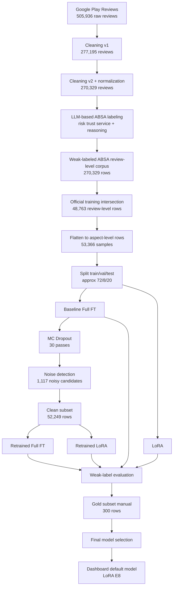

# Pipeline Sederhana: Dari Scrape Sampai Model Final

Dokumen ini menjelaskan alur model di repo ini dari awal sampai akhir, dengan bahasa sederhana dan angka yang memang ada di repo.

Kalau ada bagian yang tidak bisa dipastikan hanya dari repo, saya tulis jujur sebagai `belum jelas dari repo`.

---

## 1. Inti Besarnya

Alur besar repo ini adalah:

1. scrape review Google Play
2. preprocessing dan normalisasi
3. weak labeling skala besar
4. bentuk dataset training resmi
5. ubah review-level menjadi aspect-level rows
6. train baseline dan LoRA
7. jalankan uncertainty-aware filtering
8. buang noisy candidate
9. retrain di clean subset
10. validasi lagi dengan gold subset manual
11. pilih model yang paling layak dipakai di dashboard

---

## 2. Pipeline Angka dari Awal

## 2.1 Raw scrape

Data mentah hasil scrape:

- total raw reviews: **505,936**
- Kredivo: **263,820**
- Akulaku: **242,116**

Kolom raw:

- `app_name`
- `rating`
- `review_text_raw`
- `review_date`

---

## 2.2 Cleaning dan preprocessing

Setelah cleaning, dataset turun menjadi:

- `reviews_clean_v1_rows = 277,195`
- `reviews_clean_v2_rows = 270,329`

Jadi exclusion-nya:

- raw -> clean v1: **505,936 -> 277,195**
- yang terbuang di tahap ini: **228,741**

Lalu:

- clean v1 -> clean v2: **277,195 -> 270,329**
- yang terbuang di tahap ini: **6,866**

Langkah cleaning yang memang terlihat di repo:

- drop duplicate review
- hapus URL
- hapus emoji
- hapus unicode artifacts
- hapus newline
- lowercase
- normalisasi whitespace
- buang review kosong
- buang review terlalu pendek
- normalisasi slang/typo via lexicon v2

Catatan penting:

- punctuation dipertahankan
- stopword removal tidak dipakai
- stemming tidak dipakai

---

## 2.3 Proses labeling skala besar

Setelah review masuk ke `clean v2`, repo tidak langsung masuk ke training.

Ada tahap labeling dulu.

Di repo ini, labeling utama dilakukan dengan **LLM-based weak labeling**.

Script utamanya ada di:

- [labeling.py](/C:/Users/alvin/Downloads/skripsi/src/data/labeling.py)

Labeling ini memakai prompt anotasi yang meminta model memberi label untuk tiga aspek:

- `risk`
- `trust`
- `service`

Untuk setiap review, output yang diminta adalah:

- `risk_sentiment`
- `trust_sentiment`
- `service_sentiment`
- `reasoning`

Nilai label yang valid:

- `Positive`
- `Negative`
- `Neutral`
- `null` jika aspek tidak dibahas

Jadi prosesnya secara sederhana:

1. review clean dibaca sebagai satu unit
2. LLM menilai tiga aspek secara terpisah
3. hasilnya disimpan sebagai weak label
4. output akhir menjadi dataset ABSA review-level

Kenapa disebut weak label?

- karena label ini **bukan anotasi manual penuh**
- label ini dihasilkan model bahasa mengikuti guideline
- jadi berguna untuk skala besar, tetapi tetap berpotensi noisy

Repo juga menunjukkan bahwa prompt labeling dibuat cukup ketat:

- fokus pada teks, bukan rating
- nilai tiap aspek secara terpisah
- jika aspek tidak hadir, isi `null`
- jika mixed sentiment, pilih yang dominan
- reasoning wajib singkat

Jadi labeling di repo ini bukan asal generate sentimen umum, tetapi memang diarahkan untuk **ABSA domain fintech lending**.

## 2.4 Hasil weak labeling skala besar

Setelah clean v2, review diberi weak label untuk tiga aspek:

- `risk`
- `trust`
- `service`

Hasil review-level weak-labeled corpus:

- `dataset_absa_v2_rows = 270,329`

Artinya, secara review-level:

- setiap review punya kemungkinan label untuk lebih dari satu aspek
- kalau aspek tidak dibahas, label aspek itu bisa kosong / null

---

## 2.5 Dataset training resmi

Dataset training resmi yang dipakai eksperimen utama:

- `dataset_absa_50k_v2_intersection.csv`
- jumlah row review-level: **48,763**

Ini artinya:

- tidak semua 270k review dipakai untuk training resmi
- ada tahap pemilihan / intersection / cohort resmi

Manifest yang terkait:

- `stratified_50k_seed42_v2_intersection.csv`
- jumlah row: **48,763**

Di manifest ada kolom:

- `already_annotated`

Dengan hitungan:

- `False = 43,887`
- `True = 4,876`

Tapi arti operasional kolom ini secara penuh **belum dijelaskan jelas di repo**, jadi jangan ditafsirkan terlalu jauh tanpa cek sumber awalnya.

---

## 2.6 Dari review-level ke aspect-level training rows

Ini bagian yang sering bikin bingung.

File training resmi masih berbentuk **review-level**, tetapi saat training model, file itu diubah menjadi **aspect-level rows**.

Caranya:

- kalau satu review punya label `risk`, buat satu row `(review, risk)`
- kalau review yang sama juga punya label `service`, buat satu row `(review, service)`
- dst

Hasil akhirnya:

- total aspect-level rows: **53,366**

Distribusi aspek:

- `service = 33,223`
- `risk = 14,360`
- `trust = 5,783`

Distribusi label:

- `Negative = 27,522`
- `Positive = 24,480`
- `Neutral = 1,364`

Ini menjelaskan kenapa:

- `Neutral` sangat jarang
- `trust` jauh lebih sedikit daripada `service`

---

## 3. Sistem Split Training

Repo memakai split seperti ini:

1. aspect-level rows dibagi dulu menjadi:
   - train
   - test
2. lalu train dibagi lagi menjadi:
   - train
   - validation

Konfigurasinya:

- `test_size = 0.2`
- `val_size = 0.1` dari train

Secara kasar berarti:

- train: **72%**
- val: **8%**
- test: **20%**

Split dilakukan dengan:

- `train_test_split`
- `stratify = label_id`
- `seed = 42`

Catatan penting:

- split dilakukan di **aspect-level row**
- bukan grouped by `review_id`

Artinya ada potensi:

- review yang sama muncul di split berbeda lewat aspek yang berbeda

Ini limitation penting dan perlu disebut jujur.

---

## 4. Modelling Tahap 1

Tahap eksperimen awal memakai dataset weak-label official tadi.

Model yang diuji:

- baseline full fine-tuning
- LoRA

Backbone:

- `indobenchmark/indobert-base-p1`

Input ke model berbentuk:

```text
[ASPECT=risk] <review_text>
```

Jadi model dilatih sebagai:

- aspect-conditioned sentiment classifier

Bukan:

- overall sentiment classifier biasa

---

## 5. Hasil Tahap 1

Di weak-label evaluation utama:

- `baseline`
  - accuracy: **0.9584**
  - macro-F1: **0.7880**
- `lora`
  - accuracy: **0.9571**
  - macro-F1: **0.7849**

Artinya pada evaluasi awal:

- baseline sedikit lebih baik dari LoRA

---

## 6. Uncertainty-Aware Stage

Setelah model awal ada, repo menjalankan tahap uncertainty-aware.

Yang dipakai:

- **Monte Carlo Dropout**

Dilakukan pada:

- **53,366 aspect-level rows**

Jumlah pass:

- `num_mc = 30`

Output utamanya:

- mean probability
- uncertainty entropy
- uncertainty variance
- mismatch vs weak label

Intinya:

- model dipakai untuk memprediksi ulang dataset weak-labeled
- kalau prediksi model tidak stabil dan juga tidak cocok dengan weak label, row itu ditandai sebagai kandidat noisy

---

## 7. Noise Filtering

Hasil noise detection:

- total rows dicek: **53,366**
- noisy candidates: **1,117**
- clean rows: **52,249**
- noise ratio: **2.09%**

Threshold utama yang dipakai:

- uncertainty column: `uncertainty_entropy`
- high uncertainty quantile: **0.8**

Artinya secara praktis:

- top 20% uncertainty dijadikan area curiga
- lalu diambil yang juga mismatch dengan weak label

Catatan jujur:

- ini menghasilkan **candidate noisy labels**
- bukan bukti absolut bahwa label itu pasti salah

---

## 8. Modelling Tahap 2: Retraining

Setelah clean subset terbentuk, repo melatih ulang model dengan dua jalur:

- retrained full fine-tuning
- retrained LoRA

Jadi total regime model menjadi:

- baseline
- lora
- retrained
- retrained_lora

---

## 9. Hasil Weak-Label Setelah Retraining

Summary utama:

- `retrained`
  - accuracy: **0.9732**
  - macro-F1: **0.8283**

Pada epoch sweep:

- best weak-label run: **retrained_lora epoch 8**
  - accuracy: **0.9784**
  - macro-F1: **0.8787**

Kalau hanya lihat weak-label evaluation, ini akan terlihat sebagai model terbaik.

---

## 10. Gold Subset Manual

Supaya tidak hanya percaya weak-label, repo juga punya gold subset manual:

- total row gold subset: **300**
- present: **251**
- absent: **49**
- distribusi aspek:
  - `service = 100`
  - `risk = 100`
  - `trust = 100`

Gold subset ini dipakai untuk:

- mengecek apakah model yang bagus di weak-label juga bagus menurut penilaian manual

---

## 11. Hasil Gold Subset

Saat diuji ke gold subset, ranking model berubah.

Best gold-subset model:

- **lora_epoch8**
  - accuracy: **0.9522**
  - macro-F1: **0.8174**

Model lain yang kuat:

- `retrained_epoch8`
  - macro-F1: **0.8097**
- `baseline_epoch8`
  - macro-F1: **0.7946**

Artinya:

- model terbaik di weak-label **tidak otomatis** terbaik di gold subset

Ini insight penting dari pipeline ini.

---

## 12. Model Mana yang Dipakai di Akhir?

Kalau berdasarkan **weak-label score murni**:

- model terbaik adalah **retrained_lora epoch 8**

Kalau berdasarkan **gold/manual validation**:

- model terbaik adalah **lora_epoch8**

Untuk dashboard saat ini, default model registry diset ke:

- **LoRA E8**

Jadi secara praktis, model yang paling layak dipakai sebagai model dashboard sekarang adalah:

- **lora_epoch8**

Karena dashboard lebih cocok memakai model yang menang di validasi manual, bukan hanya menang di weak-label space.

---

## 13. Step yang Sering Tidak Disebut tapi Sebenarnya Penting

Beberapa step penting yang sering tidak disebut, padahal ada atau berpengaruh:

### A. Flattening review-level ke aspect-level

Ini sangat penting karena angka review dan angka sample training tidak sama.

### B. Split dilakukan setelah flattening

Ini memengaruhi interpretasi hasil dan potensi leakage.

### C. Weak label bukan gold truth

Jadi evaluasi awal memang berguna, tapi belum final.

### D. Uncertainty-aware filtering hanya memberi candidate noise

Bukan label pasti salah.

### E. Gold subset dipakai sebagai hakim akhir

Ini yang membuat pipeline penelitian ini lebih kuat daripada hanya weak-label benchmark.

---

## 14. Mermaid Flow



---

## 15. Penjelasan Sederhana dalam Satu Paragraf

Kalau dijelaskan paling sederhana, pipeline repo ini bekerja seperti ini: review aplikasi discrape dari Google Play, lalu dibersihkan dan dinormalisasi, kemudian diberi weak label untuk tiga aspek. Dari corpus besar itu dipilih dataset training resmi, lalu diubah dari bentuk review-level menjadi aspect-level samples untuk melatih model ABSA. Setelah baseline dan LoRA dilatih, repo menjalankan MC Dropout untuk mencari kandidat noisy label. Kandidat yang dicurigai dibuang, lalu model dilatih ulang pada clean subset. Setelah itu semua model diuji lagi, tidak hanya pada weak-label test set tetapi juga pada gold subset manual. Hasil akhirnya menunjukkan bahwa pemenang weak-label tidak otomatis menjadi pemenang manual, sehingga model yang paling layak dipakai di dashboard adalah model yang paling kuat pada validasi manual, yaitu **LoRA epoch 8**.

---

## 16. Tabel Distribusi Data Final

Tabel di bawah ini menggunakan **dataset training resmi** `dataset_absa_50k_v2_intersection.csv` setelah diubah menjadi **aspect-level rows**. Jadi ini **bukan** distribusi raw review, melainkan distribusi sample yang benar-benar masuk ke pipeline modeling.

**Table 1. Aspect-level sentiment distribution in the official training dataset**

<table>
  <thead>
    <tr>
      <th rowspan="2">Aspect Class</th>
      <th colspan="3">Sentiment Class</th>
    </tr>
    <tr>
      <th>Negative</th>
      <th>Positive</th>
      <th>Neutral</th>
    </tr>
  </thead>
  <tbody>
    <tr>
      <td>Risk</td>
      <td>10,454</td>
      <td>3,158</td>
      <td>748</td>
    </tr>
    <tr>
      <td>Service</td>
      <td>13,676</td>
      <td>19,097</td>
      <td>450</td>
    </tr>
    <tr>
      <td>Trust</td>
      <td>3,392</td>
      <td>2,225</td>
      <td>166</td>
    </tr>
    <tr>
      <td><strong>Total Data</strong></td>
      <td><strong>27,522</strong></td>
      <td><strong>24,480</strong></td>
      <td><strong>1,364</strong></td>
    </tr>
  </tbody>
</table>

Catatan singkat:

- aspek `service` adalah yang paling dominan
- label `Neutral` sangat sedikit
- distribusi ini membantu menjelaskan kenapa `Neutral` menjadi kelas yang paling sulit saat training dan evaluasi

---

## 17. Contoh Struktur Row di CSV

Tabel di bawah ini menunjukkan **contoh row nyata** dari file `dataset_absa_50k_v2_intersection.csv`. Tujuannya bukan untuk menunjukkan seluruh variasi data, tetapi untuk memperlihatkan bentuk kolom utama dan bagaimana satu review bisa memiliki satu atau lebih label aspek.

**Table 2. Example rows and main column structure from the official training CSV**

<table>
  <thead>
    <tr>
      <th>review_id</th>
      <th>app_name</th>
      <th>rating</th>
      <th>review_date</th>
      <th>review_text</th>
      <th>risk_sentiment</th>
      <th>trust_sentiment</th>
      <th>service_sentiment</th>
    </tr>
  </thead>
  <tbody>
    <tr>
      <td>126840</td>
      <td>Akulaku</td>
      <td>1</td>
      <td>2024-03-05</td>
      <td><em>gx di acc</em></td>
      <td>-</td>
      <td>-</td>
      <td>Negative</td>
    </tr>
    <tr>
      <td>250334</td>
      <td>Kredivo</td>
      <td>5</td>
      <td>2024-05-07</td>
      <td><em>baik dc nya</em></td>
      <td>Positive</td>
      <td>-</td>
      <td>-</td>
    </tr>
    <tr>
      <td>59685</td>
      <td>Kredivo</td>
      <td>5</td>
      <td>2025-05-26</td>
      <td><em>aman n cepat</em></td>
      <td>-</td>
      <td>Positive</td>
      <td>Positive</td>
    </tr>
    <tr>
      <td>617</td>
      <td>Kredivo</td>
      <td>1</td>
      <td>2026-01-03</td>
      <td><em>sllu d tolak</em></td>
      <td>Negative</td>
      <td>-</td>
      <td>-</td>
    </tr>
  </tbody>
</table>

Catatan singkat:

- tanda `-` berarti aspek itu tidak mendapat label pada row review-level tersebut
- satu review bisa punya lebih dari satu label aspek, seperti contoh `review_id = 59685`
- inilah alasan kenapa dataset review-level kemudian harus diubah lagi menjadi **aspect-level rows** sebelum training model
